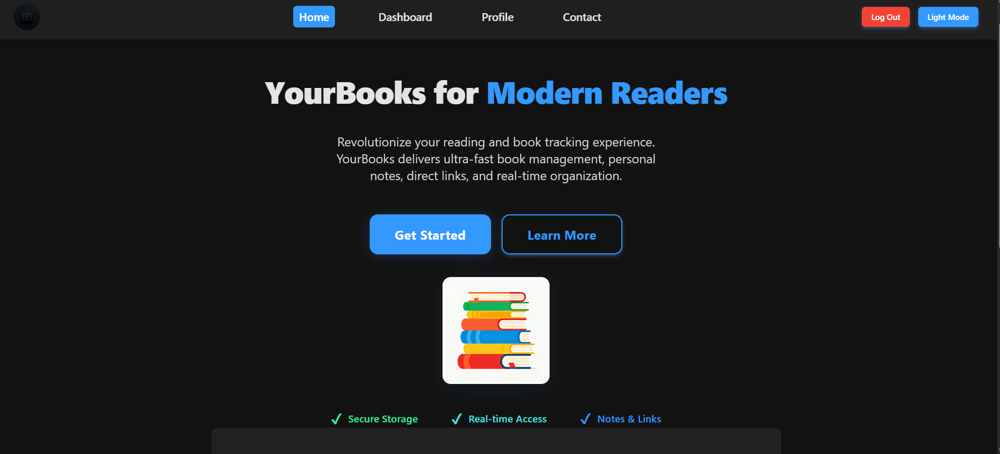
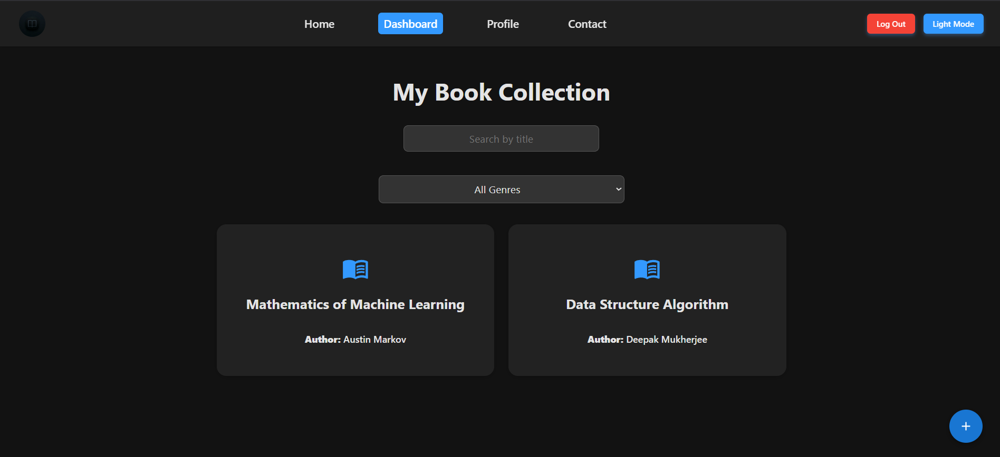
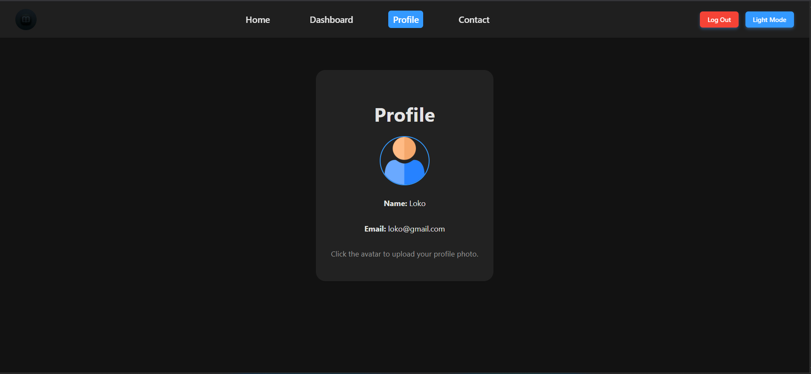
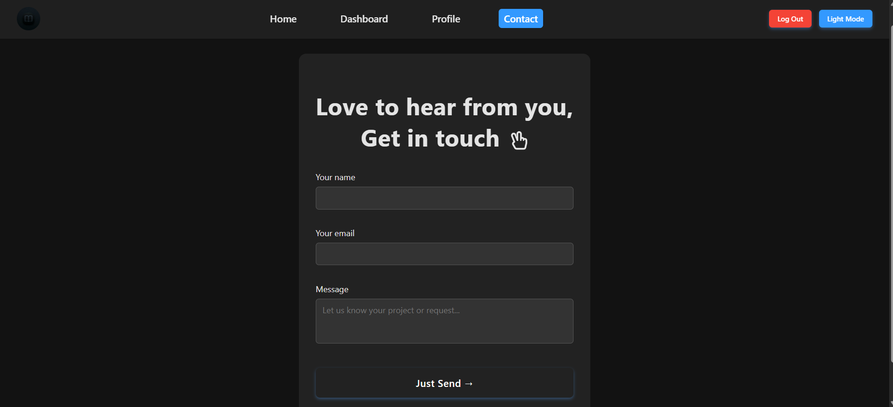

# YourBooks - A book Management App


## 📌 Overview

YourBooks is a sleek, modern web application for book lovers. Effortlessly manage your personal library, add notes and links for each book, and edit your collection with a beautiful, responsive UI. Designed for productivity and built with a React frontend, Node.js backend, and MongoDB database, it’s the perfect solution for modern readers who want their library, their way.

---

## 🟢 Live Link

[👉 Click Me to Visit the App](https://your-books-a-book-management-app.vercel.app/)


---

## 🔥 Key Features

- � **User Authentication**: Secure signup/login with JWT tokens
- 📚 **Book Management**: Add, edit, delete books with title, author, genre, rating
- � **Search & Filter**: Find books by title or filter by genre
- 📝 **Personal Notes**: Add private notes and external links to each book
- 🌓 **Theme Support**: Toggle between dark and light modes
- � **Responsive Design**: Works seamlessly on desktop and mobile
- ⚡ **Modern UI**: Animated cards, modal dialogs, and smooth transitions

---

## 🌟 User Interface

### 🏠 Home Page (Hero Section)
Bold, modern hero with big headline and "Modern Readers" accent color. Engaging call-to-action buttons, feature highlights, and logo.


### 📚 Dashboard
Animated grid view, hover to highlight, click any book for full-page overlay with notes, ratings, genre, and more.


### 👤 Profile
see your name/email. Clean, centered, with easy editing.


### ✉️ Contact Page
Simple modern mailto contact: sends user's message directly to admin email.


## 🏗️ Tech Stack

### Frontend (React.js)
- **React 18** - Modern UI library for building interactive interfaces
- **React Router v6** - Client-side routing with protected routes
- **Material UI** - Rich component library for consistent design
- **Framer Motion** - Powerful animation library for smooth transitions
- **Axios** - HTTP client for API requests with interceptors
- **Context API** - Global state management for auth and theme

### Backend (Node.js)
- **Node.js** - JavaScript runtime for server-side execution
- **Express.js** - Fast, unopinionated web framework
- **JWT (jsonwebtoken)** - Secure authentication with JSON Web Tokens
- **bcryptjs** - Password hashing and security
- **CORS** - Cross-Origin Resource Sharing support
- **dotenv** - Environment variable management

### Database (MongoDB)
- **MongoDB** - NoSQL database for flexible data storage
- **Mongoose ODM** - Elegant MongoDB object modeling
- **Schema Design**:
  ```javascript
  // User Schema
  {
    name: String,
    email: String (unique),
    password: String (hashed),
    timestamps: true
  }

  // Book Schema
  {
    user: ObjectId (ref: 'User'),
    title: String,
    author: String,
    genre: String,
    rating: Number (1-5),
    note: String,
    link: String,
    timestamps: true
  }
  ```

### Development & Deployment
- **nodemon** - Auto-reload for backend development
- **ESLint** - Code quality and style checking
- **npm** - Package management and scripts
- **Git** - Version control and collaboration
- **Environment Variables** - Secure configuration management

---

## 📂 Project Structure
```
YourBooks/
├── frontend/ # ReactJS modern UI
│ ├── src/
│ │ ├── components/ # Modern, modular UI components (Navbar, Home, Dashboard, Profile, BookForm, Contact, Footer, etc)
│ │ ├── context/ # ThemeContext.js, AuthContext.js for global state
│ │ ├── api/ # API client for backend requests
│ │ ├── assets/ # Logo and book images (logo.png, book.png, etc)
│ │ ├── styles/ # theme.css (UI color/theme styles)
│ │ ├── App.js # Main routing and layout
│ │ ├── index.js # App entry point (wraps with AuthProvider)
│ └── public/
│ └── index.html
│
├── backend/ # Node.js + Express REST API
│ ├── routes/ # Auth and books endpoints
│ ├── models/ # User and Book Mongoose schemas
│ ├── middleware/ # Auth middleware
│ ├── config/ # DB connection config
│ ├── server.js # Backend app entry
│
├── README.md # Project documentation
├── .gitignore 
```
---

## 🛠️ Setup Instructions

Clone the repo and install dependencies for each part—these steps make everything work smoothly:

### 1️⃣ Clone the Repository
```
git clone https://github.com/yourusername/yourbooks.git
cd yourbooks
```
### 2️⃣ Install Dependencies

#### 🚦 Backend (Node.js)

```
cd Backend
npm install
```
#### 🚦 Frontend (React.js)
```
cd frontend
npm install
```
### 3️⃣ Setup Environment Variables & MongoDB Atlas

#### 🗄️ Create a MongoDB Atlas Account
1. Go to [MongoDB Atlas](https://www.mongodb.com/cloud/atlas/register) and **create a free account**.  
2. After signing in, click **“Build a Database”** → choose the **Free (M0)** tier.  
3. Select your **cloud provider** (e.g., AWS) and **region** closest to you.  
4. Create a **cluster** and wait for the setup to finish.  
5. Once created, go to the **Database → Connect** section.  
6. Choose **“Connect your application”** and copy the **connection string** (it looks like this):  mongodb+srv://<username>:<password>@cluster0.xxxxxx.mongodb.net/?retryWrites=true&w=majority

#### ⚙️ Create a `.env` File in Backend

Inside your **Backend** directory, create a file named `.env` and add the following environment variables:
```
MONGO_URI=your_mongodb_connection_string_here
JWT_SECRET=your_jwt_secret_key
FRONTEND_URL=http://localhost:3000
PORT=5000
```

#### ⚙️ Create a `.env` File in Frontend
Inside your **frontend** directory, create a file named `.env` and add the following environment variable:
```
REACT_APP_API_BASE_URL=http://localhost:5000/api
```

✅ Once done, your backend and frontend will both have the necessary environment configurations to connect properly to MongoDB and your APIs.

### 4️⃣ Run the Application

#### 🚀 Start the Backend Server
```
cd backend
node server.js # or 'nodemon server.js'
```
#### 🚀 Start the Frontend (React)
```
cd frontend
npm start
```

